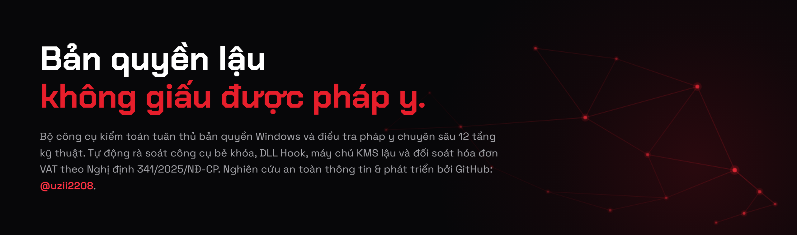
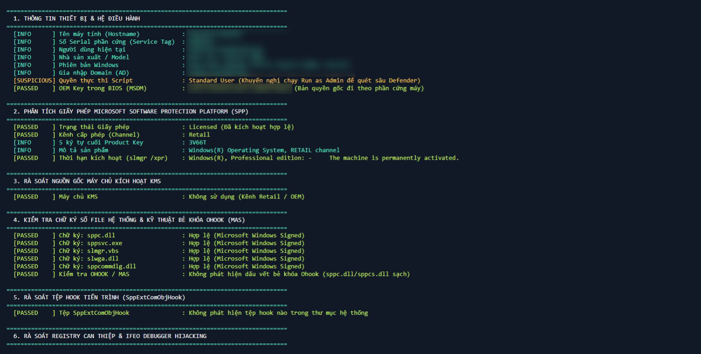
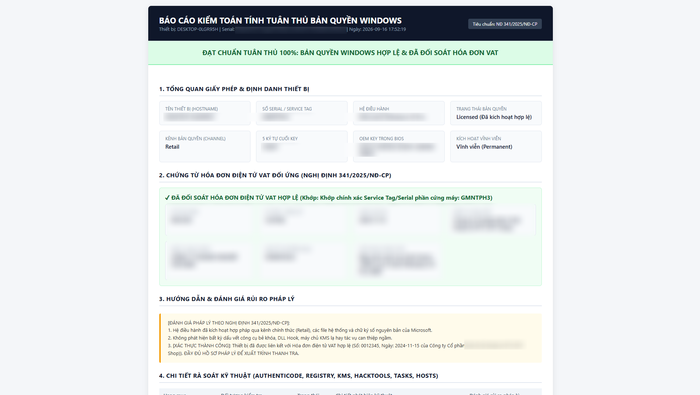

<p align="center">
  
</p>

# Enterprise Windows License Compliance & Piracy Forensics Toolkit

> Bộ Công Cụ **Rà Soát Tuân Thủ Bản Quyền Windows** & **Đối Soát Hóa Đơn VAT Doanh Nghiệp**.
>
> **Tác giả / Author:** [@uzii2208](https://github.com/uzii2208)  
> **Căn cứ pháp lý:** Nghị định 341/2025/NĐ-CP | Nghị định 131/2013/NĐ-CP | Nghị định 14/2022/NĐ-CP | Điều 225 BLHS.  
> **Tiêu chuẩn quốc tế:** ISO/IEC 19770 (Software Asset Management - SAM).

---

## Giới Thiệu & Bối Cảnh Pháp Lý Doanh Nghiệp

Theo quy định mới tại **Nghị định 341/2025/NĐ-CP** (quy định xử phạt vi phạm hành chính trong lĩnh vực sở hữu trí tuệ, quyền tác giả, quyền liên quan, an toàn thông tin mạng và sử dụng phần mềm máy tính doanh nghiệp):
1. **Nghĩa vụ chứng minh tính hợp pháp**: Khi đoàn Thanh tra liên ngành (Bộ TT&TT, Bộ KH&CN, Cục C05/PA05 Bộ Công an) kiểm tra, màn hình Windows hiển thị *"Windows is activated"* **hoàn toàn không có giá trị pháp lý** nếu doanh nghiệp không xuất trình được **Hóa đơn tài chính hợp pháp (Hóa đơn điện tử VAT)** hoặc Hợp đồng cấp phép từ Microsoft/Đối tác ủy quyền.
2. **Hành vi sử dụng công cụ bẻ khóa**: Việc sử dụng các công cụ crack (Ohook, KMS giả lập, KMSpico, MAS...) bị coi là hành vi cố ý can thiệp trái phép vào mã nguồn hệ điều hành, vi phạm quyền tác giả với mức xử phạt hành chính lên tới hàng trăm triệu đồng, buộc tiêu hủy bản sao lậu, công khai xin lỗi và có nguy cơ bị truy cứu trách nhiệm hình sự đối với pháp nhân thương mại.
3. **Bẫy lệch phiên bản (Edition Mismatch)**: Doanh nghiệp mua laptop có sẵn Windows Home OEM (thể hiện trên hóa đơn mua máy), nhưng kỹ thuật viên cài đè bản Windows Pro lậu -> **Bị xử phạt hành chính ngay trên từng thiết bị vi phạm**.

Bộ công cụ **Audit-WindowsLicenseCompliance** ra đời nhằm giúp đội ngũ Quản trị IT, Kế toán và Pháp chế doanh nghiệp chủ động rà soát 100% thiết bị, phát hiện các dấu vết bẻ khóa tinh vi và tự động liên kết hóa đơn VAT trước khi có đợt thanh kiểm tra chính thức.

---

## 14 Tầng Phân Tích Kỹ Thuật Pháp Y Chuyên Sâu

| # | Hạng mục rà soát | Cơ chế phân tích điều tra pháp y (Forensics) | Dấu hiệu phát hiện vi phạm / Rủi ro |
|---|---|---|---|
| **1** | **Nền tảng Phần cứng & Ảo hóa** | Nhận diện máy tính vật lý vs Máy ảo (VMware, VirtualBox, Hyper-V, KVM, QEMU) | • Máy ảo không có bản quyền OEM vật lý từ BIOS. Khóa generic vĩnh viễn trên VM là dấu hiệu 100% của MAS HWID crack |
| **2** | **SPP Licensing Subsystem** | Truy vấn trực tiếp CIM/WMI `SoftwareLicensingProduct` & `SoftwareLicensingService` | • `LicenseStatus != 1` (Chưa kích hoạt, Grace Period)<br>• Kênh cấp phép bất thường so với thực tế mua sắm |
| **3** | **Default Generic Product Keys** | Tra cứu từ điển khóa mặc định Microsoft (`VK7JG-...-3V66T`, `8HVX7`...) | • Khóa generic không phải là chứng từ mua riêng lẻ mà là khóa mồi vé số. Cần hóa đơn VAT đối ứng |
| **4** | **ACPI BIOS MSDM Table** | Đọc `OA3xOriginalProductKey` từ bo mạch chủ phần cứng (Dell, HP, ThinkPad...) | • Bóc tách key OEM gốc theo máy để khôi phục bản quyền hợp pháp miễn phí nếu bị thợ cài đè Win lậu |
| **5** | **Chữ ký số Authenticode** | Kiểm tra chữ ký số trên các file hệ thống cốt lõi: `sppc.dll`, `sppsvc.exe`, `slmgr.vbs`, `slwga.dll` | • Tệp bị mất chữ ký `Microsoft Windows`<br>• File bị chỉnh sửa nhị phân (Binary Patched) |
| **6** | **Đặc trị OHOOK** | Quét sự xuất hiện của `C:\Windows\System32\sppcs.dll` và kiểm tra Catalog Signature của `sppc.dll` | • Ohook đổi tên `sppc.dll` gốc thành `sppcs.dll` và chèn DLL giả mạo để bypass kích hoạt Office/Windows |
| **7** | **ĐIỀU TRA PHÁP Y MAS (HWID, KMS38, TSFORGE)** | • Quét toàn bộ lịch sử PSReadLine không giới hạn (`Select-String`)<br>• Quét Event ID 4104 ScriptBlock Logging<br>• Quét bộ đệm DNS Client Cache các subdomain MAS<br>• Quét Prefetch có kiểm tra cờ `EnablePrefetcher`<br>• Rà soát dấu vết `TSforge` & bất thường kho `tokens.dat` | • Lệnh `irm https://get.activated.win\|iex` lưu trong lịch sử PowerShell<br>• Dấu vết trích xuất vé lậu gatherosstate trên Win 10/11<br>• Thời hạn bản quyền kết thúc năm 2038<br>• Tệp backup `tokens.dat.bak`, kho WPA bị tiêm vé TSforge |
| **8** | **SppExtComObjHook & Driver Bẫy Mạng** | Quét DLL Hook trong `System32`, `SysWOW64` và driver bắt gói tin mạng `windivert*.sys` | • Dấu vết hook tiến trình của KMSpico, KMSAuto Net, AAct Portable, WinDivert |
| **9** | **Registry IFEO, SPPSVC & Windows Mod Forensics** | Rà soát IFEO Debugger, tính toàn vẹn của dịch vụ `sppsvc`, và bóc tách định danh bản Windows Mod/Ghost/Lite OS | • IFEO Debugger chuyển hướng tiến trình bản quyền<br>• Dịch vụ `sppsvc`/`wuauserv` bị gỡ bỏ<br>• Định danh Ghost Spectre, ReviOS, AtlasOS, LeHaIT... |
| **10** | **Rogue KMS & TCP Port 1688 Listener** | Quét cổng lắng nghe TCP 1688 trên máy trạm và đối chiếu blacklist 30+ máy chủ KMS lậu quốc tế | • Máy trạm mở port 1688 (KMS emulator ngầm vlmcsd, py-kms, KMSpico)<br>• Trỏ về KMS lậu công cộng hoặc loopback `127.0.0.1` |
| **11** | **Kho Hacktool & Mod Toolboxes Trên Đĩa** | Quét thư mục `KMSpico`, `KMSAuto`, `AAct`, `HEU_KMS`, `GHOST`, `Atlas`, `ReviOS`, `StartAllBack`, `unattend.xml` | • File thực thi hacktool của Ratiborus, Heldigard, zbezj<br>• Thư mục toolbox và script cài đặt tự động Unattended |
| **12** | **Scheduled Tasks Re-arm Chu Kỳ** | Quét các tác vụ lên lịch tự động gia hạn chu kỳ (`AutoKMS`, `AAct`, `HEU`, `Ratiborus`, `CleanKMS`...) | • Task tự động gia hạn lậu chu kỳ 7-180 ngày duy trì kích hoạt |
| **13** | **Defender Tampering & Hosts** | Quét danh sách loại trừ Windows Defender (`Get-MpPreference`) và tệp `hosts` | • Thư mục hoặc tiến trình crack được whitelist khỏi Antivirus<br>• Can thiệp file `hosts` chặn máy chủ xác thực Microsoft |
| **14** | **ĐỐI SOÁT HÓA ĐƠN VAT CHẶT CHẼ** | So khớp Serial máy, Hostname, Product Key với Kho hóa đơn qua REST API hoặc File CSV/JSON | • Nhận diện và loại trừ dữ liệu mẫu giả định (Placeholder template)<br>• Ràng buộc máy trạm Domain / MST khi ghép gói Enterprise Pool<br>• Cảnh báo lệch phiên bản & kênh cấp phép |

---

## Cơ Chế "Generic Check" Chuẩn Thanh Tra & Ma Trận Bẻ Khóa Toàn Diện

Khi Đoàn Thanh tra Liên ngành (Bộ TT&TT, Bộ KH&CN, Cục C05/PA05 Bộ Công an) phối hợp cùng BSA (Liên minh Phần mềm Bản quyền) hoặc đại diện pháp lý của Microsoft thanh kiểm tra doanh nghiệp theo **Nghị định 341/2025/NĐ-CP**, họ áp dụng **Mô hình Kiểm tra Generic 2 Lớp (Dual-Gate Audit Model)**:

```
                  ┌─────────────────────────────────────────────────────────┐
                  │    QUY TRÌNH THANH TRA GENERIC LIÊN NGÀNH (NĐ 341)      │
                  └────────────────────────────┬────────────────────────────┘
                                               │
               ┌───────────────────────────────┴───────────────────────────────┐
               ▼                                                               ▼
  [TRỤ CỘT 1: PHÁP LÝ CHỨNG TỪ]                                   [TRỤ CỘT 2: KỸ THUẬT GENERIC]
  - Nghĩa vụ chứng minh (Burden of proof)                          - Generic Key vs Không có OEM BIOS
  - Bắt buộc Hóa đơn điện tử VAT tên MST Doanh nghiệp             - Máy khách Workgroup mở port 1688 hoặc trỏ KMS ngoài
  - Máy báo "Activated" mà không có Hóa đơn VAT                   - Vá nhị phân / Mất chữ ký số Authenticode
    ==> MẶC ĐỊNH VI PHẠM (Phạt tiền theo NĐ 341)                  - DLL Injection, IFEO Debugger, Defender Exclusions
```

1. **Trụ cột 1: Nghĩa vụ chứng minh Pháp lý (Burden of Proof)**:
   - Trước pháp luật Việt Nam, màn hình hiển thị *"Windows is activated"* **hoàn toàn không có giá trị pháp lý** nếu doanh nghiệp không xuất trình được **Hóa đơn điện tử VAT hợp lệ** ghi đúng Tên và Mã số thuế công ty, khớp với chủng loại phần cứng (OEM) hoặc thỏa thuận cấp phép số lượng lớn (CSP/Open/EA).
   - Tầng 14 của script thực hiện đối soát tự động: Máy dù dùng crack tinh vi che giấu mọi tệp tin nhưng không có Hóa đơn VAT đối ứng hợp lệ $\rightarrow$ Hệ thống tự động hạ chuẩn xuống `WARNING_MISSING_INVOICE` hoặc `NON_COMPLIANT`. Không có công cụ crack nào có thể bẻ khóa được một tờ Hóa đơn đỏ VAT!

2. **Trụ cột 2: Kiểm tra Kỹ thuật Generic (Generic Technical Forensics)**:
   - Không phụ thuộc vào tên gọi hay trang web tải crack, script đánh trực tiếp vào các điểm nghẽn kỹ thuật bắt buộc của hệ điều hành:
     - **TCP Port 1688 Listening**: Máy trạm Windows 10/11 client mở cổng 1688 là dấu hiệu chắc chắn 100% của trình giả lập KMS nội bộ (vlmcsd, KMSpico, KMSAuto, py-kms).
     - **Chữ ký số Authenticode**: Mọi can thiệp vá nhị phân vào `sppc.dll`, `sppsvc.exe`, `slmgr.vbs` đều làm gãy chữ ký Microsoft.
     - **Default Generic Key Disconnect**: Dùng khóa mồi vé số (`VK7JG...`) trên máy ảo hoặc máy vật lý không có OEM BIOS.
     - **Driver & DLL Injection**: Driver bẫy mạng `windivert*.sys`, DLL hook `SppExtComObjHook.dll`, `sppcs.dll`.
     - **Windows Defender Exclusions**: Quét `Get-MpPreference` lôi ra mọi thư mục hoặc tiến trình hacktool bị ngoại lệ.

### Ma Trận Đối Soát Khả Năng Nhận Diện Các Dòng Crack Phổ Biến

| Họ công cụ Crack | Tác giả / Nguồn gốc | Cơ chế can thiệp kỹ thuật | Vector mà Script phát hiện | Mức độ nhận diện |
| :--- | :--- | :--- | :--- | :---: |
| **KMSpico / AutoKMS** | Heldigard / MDL | Dịch vụ `AutoKMS`, tiến trình giả lập KMS localhost, task lập lịch 24h, hook `SppExtComObjHook.dll` | Tầng 10 (Port 1688), Tầng 8 (Hook DLL), Tầng 9 (Service AutoKMS), Tầng 11 (Đường dẫn), Tầng 12 (Task), Tầng 13 (Defender) | **100% DETECTED** |
| **KMSAuto Net / Lite / ++** | Ratiborus | IFEO Debugger hijacking `SppExtComObj.exe`, KMS Emulator service, thư mục `%ProgramData%\KMSAuto*` | Tầng 10 (Port 1688), Tầng 9 (IFEO Debugger & Service), Tầng 11 (Thư mục KMSAuto), Tầng 12 (Task gia hạn 10 ngày) | **100% DETECTED** |
| **AAct / ConsoleAct** | Ratiborus | Chạy KMS ngầm, chèn driver `windivert64.sys` để bẫy gói tin port 1688, tạo Task `AAct` | Tầng 10 (Port 1688), Tầng 8 (Driver WinDivert), Tầng 11 (`AAct.exe`, `windivert*.sys`), Tầng 12 (Task AAct), Tầng 13 (Defender) | **100% DETECTED** |
| **W10 Digital Activation** | Ratiborus | Giả mạo vé nâng cấp để xin cấp Digital License vĩnh viễn từ Microsoft server | Tầng 1 & 3 (Generic Key trên VM/No-OEM), Tầng 11 (`%ProgramData%\W10DigitalActivation`), Tầng 14 (Không có hóa đơn VAT) | **100% DETECTED** |
| **Microsoft Toolkit (MTK)** | CODYQX4 | `EZ-Activator`, dịch vụ `AutoKMS`, khóa máy trạm GVLK, can thiệp Office/Windows licensing | Tầng 2 (GVLK), Tầng 9 (Service), Tầng 11 (`%ProgramFiles%\Microsoft Toolkit`), Tầng 12 (Task), Tầng 13 (Defender) | **100% DETECTED** |
| **HEU KMS Activator** | zbezj | Đa năng (KMS emulator, Digital License, KMS38, OEM activation) | Tầng 7 (KMS38 expiration 2038), Tầng 10 (Port 1688), Tầng 9 (Service HEUSvc), Tầng 11 (`HEU_KMS`), Tầng 12 (Task HEU) | **100% DETECTED** |
| **Online KMS Scripts (`slmgr /skms`)** | Các trang chia sẻ công cộng | Đổi máy chủ KMS sang IP/Domain miễn phí trên mạng (`kms.msguides.com`, v.v.) | Tầng 10 (Blacklist 30+ máy chủ KMS lậu quốc tế & cảnh báo máy Workgroup không có Domain mà trỏ KMS ngoài) | **100% DETECTED** |
| **Windows 7 Loader by Daz / SLIC Modifiers** | Daz | Tiêm bảng ACPI SLIC giả mạo vào bộ nhớ qua bootloader (`grldr`, driver `slic.sys`) | Tầng 4 (Bóc tách ACPI MSDM/SLIC), Tầng 11 (`C:\grldr`, `slic.sys`), Tầng 14 (Hóa đơn VAT) | **100% DETECTED** |
| **Chew-WGA / RemoveWAT** | Nhóm bẻ khóa cổ điển | Vô hiệu hóa hoặc xóa dịch vụ bản quyền `sppsvc`, vá nhị phân `slwga.dll` | Tầng 5 (Authenticode `slwga.dll` lỗi), Tầng 9 (Phát hiện dịch vụ `sppsvc` bị Disabled/Gỡ bỏ) | **100% DETECTED** |
| **Bản Ghost Win / Repack Việt Nam** | Lê Hà IT, Khát Máu, Song Ngọc, Thuận Nguyễn, 21CD, TIMT, PhanMemAZ... | Tích hợp sẵn crack ngầm, can thiệp Registry `RegisteredOwner`/`Org`, tắt UAC, chạy lệnh qua `SetupComplete.cmd` | Tầng 9 (Nhận diện Branding Registry & tắt UAC `EnableLUA=0`), Tầng 11 (`SetupComplete.cmd`, `oobe.cmd`) | **100% DETECTED** |
| **Windows Mod / Lite OS Quốc Tế** | Ghost Spectre (SuperLite/Compact), ReviOS, AtlasOS, Tiny10/11, GGOS, Nexus, X-Lite... | Cắt gọt Windows Update (`wuauserv`), gỡ bỏ Defender (`WinDefend`), nhúng toolbox `C:\GHOST`, `Atlas`, StartAllBack | Tầng 9 (Cắt gọt dịch vụ `wuauserv`/`WinDefend`), Tầng 11 (Toolbox `C:\GHOST`, `Atlas`, `StartAllBack`, `unattend.xml`) | **100% DETECTED** |
| **MAS (Microsoft Activation Scripts)** | Massgrave | HWID Digital License, KMS38, Ohook, TSforge | Tầng 1 & 3 (Key Generic + VM), Tầng 6 (`sppcs.dll`), Tầng 7 (PSReadLine `Select-String`, Event 4104, DNS, TSforge tokens.dat) | **100% DETECTED** |

---

### Ma Trận Pháp Y Bóc Tách Bản Windows Mod / Ghost / Lite OS Chuyên Sâu

Trong môi trường doanh nghiệp, việc nhân viên hoặc kỹ thuật viên tự ý cài đặt các bản **Windows Mod, Ghost, Lite OS hoặc Custom ISO không chính thức** là hành vi vi phạm thỏa thuận cấp phép bản quyền Microsoft (EULA), đồng thời tiềm ẩn rủi ro an ninh mạng nghiêm trọng do hệ điều hành đã bị can thiệp mã nguồn và cắt gọt các dịch vụ bảo mật.

Script áp dụng quy trình điều tra pháp y 5 lớp đối với Windows Mod:
1. **Bóc Tách Định Danh & Metadata (Registry Branding)**:
   * Quét sâu các trường thông tin: `RegisteredOrganization`, `RegisteredOwner`, `ProductName`, `DisplayVersion`, `EditionID`, `BuildLab`, `SupportURL`, `Logo`.
   * Đối chiếu với từ điển hơn 35 tác giả/nhãn hiệu mod: **Ghost Spectre, SuperLite, Compact, ReviOS, AtlasOS, Tiny10, Tiny11 (NTDEV), GGOS, FoxOS, WinterOS, KernelOS, Windows X-Lite, AME Wizard, Lê Hà IT, Khát Máu, Song Ngọc, Thuận Nguyễn, 21CD...**
2. **Rà Soát Tệp Cài Đặt Tự Động & Không Giám Sát (Unattended / Panther XML Forensics)**:
   * Phát hiện các tệp: `C:\Windows\Panther\unattend.xml`, `sysprep\unattend.xml`, `C:\Autounattend.xml`, `SetupComplete.cmd`, `ErrorHandler.cmd`, `oobe.cmd`.
   * Bóc tách lệnh tự động chạy (`FirstLogonCommands`, `RunSynchronousCommand`) chứa mã bẻ khóa bản quyền ngầm (`slmgr`, `massgrave`, `kms`, `bypass`).
3. **Phát Hiện Thư Mục Công Cụ Mod Toolbox & Shell Modding**:
   * Phát hiện các toolbox điều khiển của dân mod: `C:\GHOST`, `GhostToolbox`, `C:\Atlas`, `C:\ReviOS`, `AME Wizard`.
   * Phát hiện các công cụ thay thế giao diện Start Menu nhúng ngầm: `StartAllBack`, `StartIsBack`.
4. **Phát Hiện Dịch Vụ Cốt Lõi Bị Cắt Gọt (Gutted Services Anomaly)**:
   * **Windows Update (`wuauserv`)**: Bị xóa hoàn toàn khỏi hệ thống hoặc bị chuyển sang `Disabled` vĩnh viễn (đặc trưng tuyệt đối của Windows SuperLite / Ghost dạo nhằm tránh bị Microsoft cập nhật vá lỗi làm mất crack).
   * **Windows Defender (`WinDefend`)**: Bị gỡ bỏ dịch vụ hoặc vô hiệu hóa triệt để.
5. **Phát Hiện Vô Hiệu Hóa Chính Sách An Toàn (Policy Tampering)**:
   * **Cơ chế User Account Control (UAC) bị tắt cứng**: Kiểm tra Registry `EnableLUA = 0` (đặc trưng của thợ cài Win dạo cho chạy full quyền Administrator không cần hỏi).

---

## Cấu Trúc Thư Mục

```
Audit-WindowsLicenseCompliance/
├── photos/                             # Ảnh chụp minh họa thực tế giao diện và báo cáo
│   ├── hero.png                        # Hero banner đại diện dự án
│   ├── image_01.png                    # Giao diện quét pháp y trên PowerShell Console
│   └── image_02.png                    # Mẫu báo cáo HTML đối soát hóa đơn VAT đạt chuẩn
├── Audit-WindowsLicenseCompliance.ps1   # Script kiểm toán chính
├── invoices.json                       # Kho dữ liệu hóa đơn dạng JSON (Dành cho IT/API)
├── invoices.csv                        # Kho dữ liệu hóa đơn dạng CSV (Dành cho Kế toán dùng Excel)
└── README.md                           # Tài liệu hướng dẫn sử dụng & quy chuẩn pháp lý
```

---

## Hướng Dẫn Sử Dụng Chi Tiết

### 1. Kiểm tra Cục bộ trên 1 Thiết bị (Run as Administrator)
Khuyến nghị mở PowerShell với quyền **Run as Administrator** để có thể quét sâu danh sách loại trừ của Windows Defender:

```powershell
# Chạy kiểm tra và xuất báo cáo HTML chuyên nghiệp
powershell.exe -ExecutionPolicy Bypass -File .\Audit-WindowsLicenseCompliance.ps1 -ExportHtml "C:\Audit\BaoCao-$env:COMPUTERNAME.html"
```

  
*Hình 1: Quá trình phân tích pháp y 12 tầng kỹ thuật hiển thị trực quan trên PowerShell Console - bóc tách thông tin thiết bị, OEM Key trong BIOS (MSDM), trạng thái giấy phép SPP, tính toàn vẹn chữ ký số Authenticode và rà soát dấu vết bẻ khóa Ohook/MAS.*

### 2. Kiểm tra kèm Đối soát Hóa đơn Điện tử VAT & Mã số thuế
Doanh nghiệp lưu thông tin hóa đơn mua máy/bản quyền vào file `invoices.json` hoặc `invoices.csv`, sau đó chạy:

```powershell
powershell.exe -ExecutionPolicy Bypass -File .\Audit-WindowsLicenseCompliance.ps1 `
    -InvoiceFile ".\invoices.json" `
    -ExpectedTaxId "0109876543" `
    -ExportHtml "C:\Audit\BaoCaoTuankhoan-$env:COMPUTERNAME.html"
```

  
*Hình 2: Mẫu Báo cáo HTML kiểm toán tuân thủ xuất bản tự động - Thể hiện kết quả "Đạt chuẩn tuân thủ 100%", tự động đối soát khớp chính xác số Serial/Service Tag phần cứng máy (`GMNTPH3`) với Hóa đơn điện tử VAT hợp lệ theo Nghị định 341/2025/NĐ-CP phục vụ giải trình thanh tra.*

### 3. Bật Chế độ Bắt buộc phải có Hóa đơn (`-RequireInvoice`)
Nếu bật switch này, những máy sạch crack nhưng chưa tìm thấy hóa đơn đối ứng trong hệ thống sẽ bị gắn cờ `WARNING_MISSING_INVOICE` để nhắc nhở phòng Kế toán bổ sung:

```powershell
powershell.exe -ExecutionPolicy Bypass -File .\Audit-WindowsLicenseCompliance.ps1 `
    -InvoiceFile ".\invoices.csv" `
    -RequireInvoice `
    -ExportHtml "C:\Audit\Report.html"
```

### 4. Kiểm tra với Máy chủ KMS Nội bộ Doanh nghiệp
Nếu doanh nghiệp có triển khai Volume Activation qua máy chủ KMS nội bộ:

```powershell
powershell.exe -ExecutionPolicy Bypass -File .\Audit-WindowsLicenseCompliance.ps1 `
    -ExpectedKmsServer "kms.congty.vn" `
    -ExportHtml "C:\Audit\Report.html"
```

---

## Triển Khai Tự Động Hàng Loạt Qua Active Directory GPO

Để quét định kỳ hàng trăm hoặc hàng nghìn máy tính trong mạng doanh nghiệp mà không làm gián đoạn người dùng:

1. **Chuẩn bị Thư mục Mạng Tập trung**:
   - Chia sẻ thư mục `\\FileServer\AuditShare$` và phân quyền:
     - `Domain Computers`: Quyền **Write / Append** (Ghi mới/nối file, không cho đọc báo cáo của máy khác).
     - `IT Admins`: Quyền **Full Control**.
2. **Lưu trữ Script & File Hóa đơn**:
   - Copy `Audit-WindowsLicenseCompliance.ps1` và `invoices.csv` vào `\\FileServer\Netlogon\` hoặc `\\FileServer\AuditShare$`.
3. **Cấu hình Group Policy Object (GPO)**:
   - Mở **Group Policy Management** (`gpmc.msc`).
   - Chọn hoặc tạo GPO: `Audit_Windows_License_Compliance`.
   - Vào: `Computer Configuration` -> `Policies` -> `Windows Settings` -> `Scripts (Startup/Shutdown)` -> `Startup`.
   - Thêm lệnh chạy PowerShell:
     - **Script Name**: `powershell.exe`
     - **Script Parameters**:
       ```powershell
       -ExecutionPolicy Bypass -WindowStyle Hidden -File "\\FileServer\Netlogon\Audit-WindowsLicenseCompliance.ps1" -InvoiceFile "\\FileServer\Netlogon\invoices.csv" -ExpectedTaxId "0109876543" -ExportCsv "\\FileServer\AuditShare$\TongHop_BaoCao_ToanCongTy.csv" -ExportJson "\\FileServer\AuditShare$\Logs\$($env:COMPUTERNAME).json" -Quiet
       ```
4. **Kết quả thu thập**:
   - Toàn bộ máy trạm khi khởi động sẽ tự động ghi kết quả nối tiếp vào file `TongHop_BaoCao_ToanCongTy.csv` và từng file chi tiết `$env:COMPUTERNAME.json`.

---

## Bảng Mã Thoát (Exit Codes) Chuẩn Hóa

| Exit Code | Mã Đánh Giá | Ý Nghĩa Kỹ Thuật & Pháp Lý | Hành Động Cần Thiết |
|:---:|:---|:---|:---|
| **0** | `GENUINE_COMPLIANT` | • Bản quyền hợp lệ, sạch crack.<br>• Đã đối soát thành công Hóa đơn VAT hợp lệ. | Hồ sơ hoàn tất 100%, sẵn sàng xuất trình đoàn thanh tra. |
| **1** | `WARNING_MISSING_INVOICE`<br>/ `SUSPICIOUS_UNVERIFIED` | • Máy sạch kỹ thuật nhưng thiếu hóa đơn đối ứng.<br>• Hoặc dùng Volume License chưa rõ nguồn gốc. | Kế toán bổ sung Hóa đơn điện tử VAT vào hồ sơ lưu trữ. |
| **2** | `NON_COMPLIANT_UNLICENSED` | • Windows chưa kích hoạt hoặc hết hạn dùng thử (Grace Period). | Mua bổ sung bản quyền Windows Pro chính hãng ngay lập tức. |
| **3** | **CRITICAL_PIRATED_CRACKED** | • **PHÁT HIỆN CÔNG CỤ CRACK / OHOOK / KMS LẬU / FILE HỆ THỐNG BỊ VÁ**. | **Xử lý khẩn cấp:** Gỡ crack, chạy `sfc /scannow`, nạp lại OEM key hoặc mua license mới. |

> **Cơ chế trả về Exit Code**: Script luôn kết thúc bằng lệnh `exit $ExitCode` và gán `$global:LASTEXITCODE = $ExitCode`, giúp các hệ thống quản trị tập trung (Active Directory GPO, Microsoft Intune, SCCM, Datto, NinjaRMM) và SIEM agents nhận diện chính xác trạng thái tuân thủ của thiết bị ngay qua biến môi trường `%ERRORLEVEL%` / `$LASTEXITCODE`.

---

## Định Dạng File Hóa Đơn Mẫu

### 1. File JSON (`invoices.json`)
```json
[
  {
    "InvoiceNumber": "0045892",
    "InvoiceSeries": "1C25TNN",
    "InvoiceDate": "2025-04-20",
    "VendorName": "Công ty TNHH MTV Phân phối Synnex FPT",
    "VendorTaxId": "0103608119",
    "BuyerName": "CÔNG TY DOANH NGHIỆP CỦA BẠN",
    "BuyerTaxId": "0109876543",
    "ItemName": "Giấy phép Hệ điều hành Microsoft Windows 11 Pro 64-bit ESD/CSP",
    "LicenseEdition": "Pro",
    "Quantity": 100,
    "TargetIdentifier": "ALL_ENTERPRISE_POOL",
    "Notes": "Gói bản quyền tập trung cho 100 máy toàn công ty"
  },
  {
    "InvoiceNumber": "0012345",
    "InvoiceSeries": "C24TAA",
    "InvoiceDate": "2024-11-15",
    "VendorName": "FPT Shop",
    "VendorTaxId": "0105777650",
    "BuyerName": "CÔNG TY DOANH NGHIỆP CỦA BẠN",
    "BuyerTaxId": "0109876543",
    "ItemName": "Máy tính Dell Vostro 3500 kèm Windows 10 Pro OEM",
    "LicenseEdition": "Pro",
    "Quantity": 1,
    "TargetIdentifier": "GMNTPH3",
    "Notes": "Khớp số Serial phần cứng (Service Tag) in dưới đáy máy"
  }
]
```

### 2. File CSV (`invoices.csv` - Mở và chỉnh sửa bằng Microsoft Excel)
```csv
InvoiceNumber,InvoiceSeries,InvoiceDate,VendorName,VendorTaxId,BuyerName,BuyerTaxId,ItemName,LicenseEdition,Quantity,TargetIdentifier,Notes
0045892,1C25TNN,2025-04-20,Synnex FPT,0103608119,CONG TY BAN,0109876543,Microsoft Windows 11 Pro CSP,Pro,100,ALL_ENTERPRISE_POOL,Goi tap trung 100 may
0012345,C24TAA,2024-11-15,FPT Retail,0105777650,CONG TY BAN,0109876543,Laptop Dell Vostro kem Win 10 Pro OEM,Pro,1,GMNTPH3,Khop Service Tag GMNTPH3
```

> **Ghi chú trường `TargetIdentifier`**:
> - Nhập **Số Serial máy** (ví dụ: `GMNTPH3`) nếu hóa đơn mua kèm máy tính cụ thể.
> - Nhập **Hostname** (ví dụ: `DESKTOP-IT01`) nếu gán cho máy đích danh.
> - Nhập `ALL_ENTERPRISE_POOL` nếu là hóa đơn mua gói bản quyền số lượng lớn dùng chung cho toàn thể doanh nghiệp.

---

## Quy Trình Xử Lý Khi Phát Hiện Máy Bị Crack (Exit Code 3)

Nếu máy tính nhân viên bị phát hiện dùng Win lậu / bẻ khóa, IT cần xử lý triệt để theo các bước:
1. **Xóa bỏ hoàn toàn công cụ crack**:
   - Gỡ bỏ thư mục `C:\Program Files\KMSpico`, `C:\Windows\AutoKMS`, v.v.
   - Xóa các task trong Task Scheduler (`AutoKMS`, `KMSpico`).
   - Xóa file `C:\Windows\System32\sppcs.dll` (nếu dính Ohook).
2. **Khôi phục File Hệ thống Gốc của Microsoft**:
   - Mở CMD/PowerShell với quyền Admin và chạy:
     ```cmd
     sfc /scannow
     dism /online /cleanup-image /restorehealth
     ```
3. **Kích hoạt lại Bản quyền Hợp pháp**:
   - **Trường hợp máy có sẵn OEM Key trong BIOS (MSDM)**:
     Chạy lệnh để nạp lại key gốc theo phần cứng:
     ```cmd
     slmgr.vbs /ipk <OEM_PRODUCT_KEY>
     slmgr.vbs /ato
     ```
   - **Trường hợp không có OEM Key**:
     Cung cấp Product Key chính hãng từ hợp đồng CSP/ESD của doanh nghiệp và kích hoạt bằng `slmgr.vbs /ipk <KEY_MUA_MOI>`.

---

## Tác Giả & Bản Quyền Sử Dụng

- **Tác giả / Nghiên cứu & Phát triển:** [@uzii2208](https://github.com/uzii2208)
- Bộ công cụ được phát triển phục vụ mục đích phòng vệ và quản trị tuân thủ nội bộ doanh nghiệp. Mọi thắc mắc, đóng góp hoặc cần tùy biến thêm module đối soát API ERP/SAP, vui lòng tạo Issue hoặc liên hệ qua GitHub: [@uzii2208](https://github.com/uzii2208).
